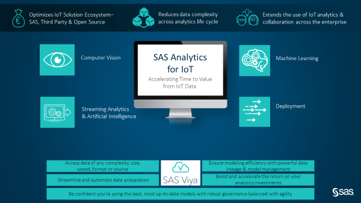
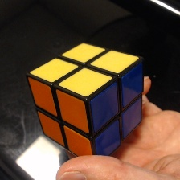
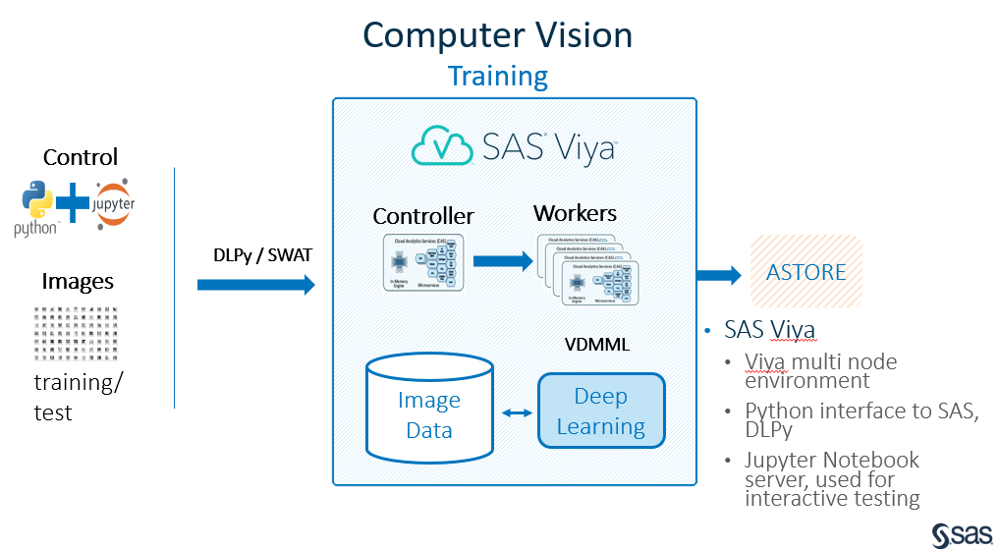
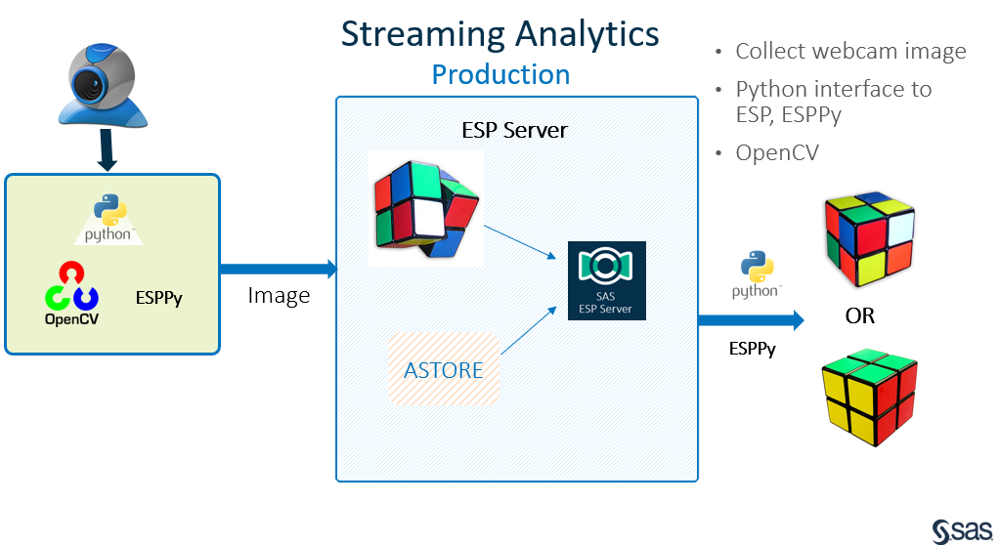
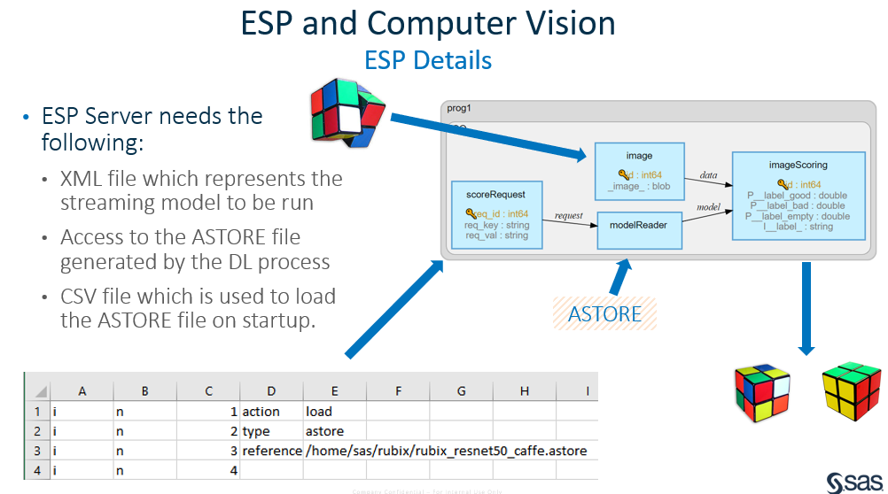
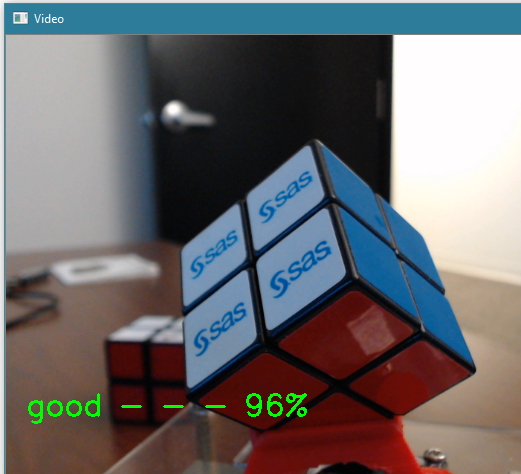
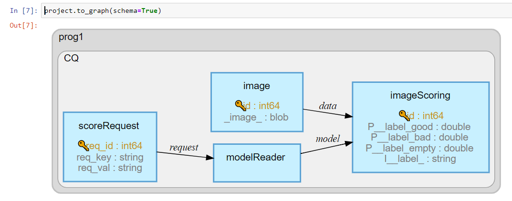
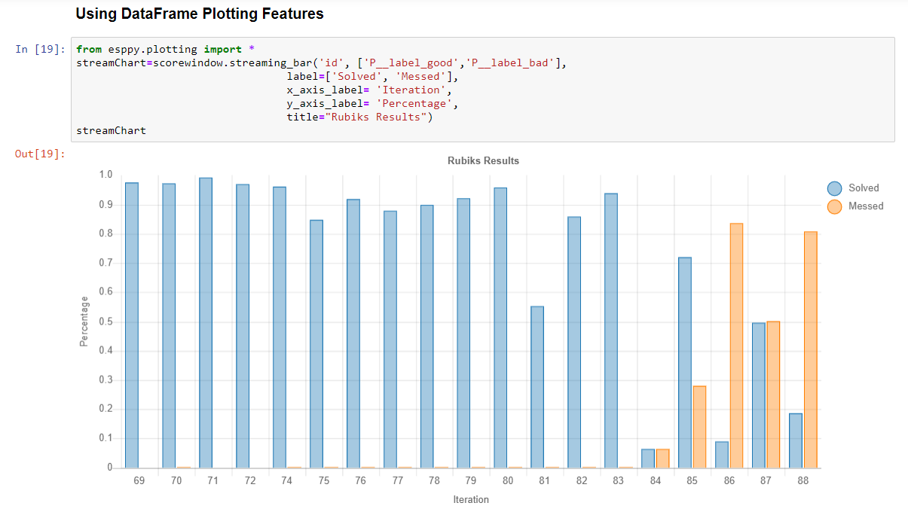

# Image Classification Using Rubik’s Cubes

    

In this repository, you'll learn the steps for building and deploying an image classification model.

### Prerequisites

List of required software offered as part of [SAS Analytics for IoT](https://www.sas.com/en_us/software/analytics-iot.html):
 
   * [SAS Visual Data Mining and Machine Learning](https://www.sas.com/en_us/software/visual-data-mining-machine-learning.html)
   * [SAS Event Stream Processing](https://www.sas.com/en_us/software/event-stream-processing.html)
   * [SAS Deep Learning Python Interface](https://sassoftware.github.io/python-dlpy/)
   * [SAS Scripting Wrapper for Analytics Transfer](https://sassoftware.github.io/python-swat/)
   * [SAS Event Stream Processing Python Interface](https://pypi.org/project/sas-esppy/)

## Overview

This repository will show you how to use two of the products found in [SAS Analytics for IoT](https://www.sas.com/en_us/software/analytics-iot.html) to train and build an image classification model.

  * [SAS Visual Data Mining and Machine Learning](https://www.sas.com/en_us/software/visual-data-mining-machine-learning.html)
  * [SAS Event Stream Processing](https://www.sas.com/en_us/software/event-stream-processing.html)

These two products provide the tools needed when training, testing, and running [Computer Vision](https://www.sas.com/en_us/insights/analytics/computer-vision.html) (CV) models.  This repository will cover the following topics: 

  *  Define the use case for a manufacturing quality example
  *  Gathering and classifying training data
  *  Train CV models using the SAS Deep Learning Python (DLPY) package
  *  Operationalize our models using streaming analytics and ESPPy
  
## Use Case

Imagine you are responsible for manufacturing quality at your company.  Wouldn't it be great to know what percentage of product contains flaws?  Maybe replace human oversite with automation or collect data to perform a root cause analysis.  [SAS Analytics for IoT](https://www.sas.com/en_us/software/analytics-iot.html) is a perfect solution to solve this or any [Computer Vision](https://www.sas.com/en_us/insights/analytics/computer-vision.html) (CV) problem.  This comprehensive AI-embedded solution provides so many capabilities because it integrates a number of key SAS products (see the figure below).

In this use case, we are going to simulate our manufacturing process using a Rubik's cube.  Our cube represents a part which is being produced, and it is up to us to determine whether it was manufactured correctly.  

## First off, let's talk Computer Vision

CV techniques provide the ability to acquire, process and analyze incoming images. This analysis produces numerical results in the form of predictions based on the classes we define.  In this example, we need to create one CV model which will be used to tell if a Rubik's cube is solved or unsolved.  We will also add in a third class which will represent any image where the cube isn't properly presented to the camera. We don't want to score images where there is no cube present or the camera can only see one side of the cube.  Having an invalid case makes the predictions more accurate.  Since we are using image classification without object detection our cubes must be correctly positioned within the camera frame in order to get accurate results.  Here is an example of a correclty positioned cube:

Idealy, three sides of the cube should be visible to the camera and you would need two cameras to know for sure that the cube is correctly manufactured.  However, for this example I am considering two visible sides valid, and simply holding the cube in my hand as I wait for the image to be scored. 

## Creating a training dataset

The first step in the process is creating an awesome training dataset.  When building your dataset remember these axioms: 

  * A Computer Vision model is only as good as the dataset it was trained on
  * If you can't see it in the picture, the computer won't be able to tell either
  * If possible collect images from the production environment
   
It is recommended that no less than 1000 images be used for each class you intend to train and more images are always better.   These images are also subdivided into two datasets.  The first is for training and the second is a testing dataset.  Therefore, an additional 200 images for testing is also recommended.  Image size should be no less than 224 by 224 pixels.  

You may use the images found in the [TrainingImages](./training/TrainingImages.zip) zip file which accompanies this repository to reproduce this model on your system.  You may need to add your own images to the training dataset. For example, I was told that Rubik's cubes in Brazil have different colors.  Because of this, I am also including the python script which was used to capture these images.  To learn more about using the [WebcamJPGCollector](./training/WebcamJPGCollector.py) script please watch the following video: 

At the end of this exercise you should have 3 directories.  One for each class of your analytical model.  I named them good, bad and empty.   

## Next, we train our models

Before we build an application that uses analytical models to predict outcomes, we need to train them.  The training process for CV involves classifying images and separating these images into datasets that can then be fed into a [machine learning](https://www.sas.com/en_us/insights/analytics/machine-learning.html) model such as ResNet50, VGG16, or Darknet.  This stage of the process is completed using the [SAS Deep Learning Python (DLPy)](https://github.com/sassoftware/python-dlpy) package which provides the high-level **Python APIs** to the deep learning methods in **SAS Visual Data Mining and Machine Learning** (VDMML).

The previous diagram illustrates the flow for training a deep learning analytical model.  Starting from the left we see that a Jupyter notebook is used to issue DLPy and SWAT commands which communicate with SAS Viya.  For large jobs Viya has the ability to farm processing out to workers and take advantage of parallel processing.   GPU support is also available.   Deep learning algorithms are then invoked as each image is processed to create a portable analytics file called an .astore file.  A typical training exercise contains these steps:

* Setup libraries and launch CAS
* Load and explore the training data
* Prepare the data for modeling
* Specify the model architecture, configure model parameters and import pre-trained weights
* Fit the image detection and classification model
* Evaluate the newly created image classification model
* Visualize model results
* Save model as .astore for deployment

## Training using DLPy

Model training is optional for this accelerator since the pre-trained .astore file is provided.  However, contained in the training directory of this repository is the Jupyter notebook which was used during model training.  Please refer to this notebook in order to learn how to train your own computer vision analytic models.  

  * [Rubik's cube training example](./training/RubiksCubeDL.ipynb)
  
To understand more about using DLPy to train image classification models please view the following video.

 
For more information about the DLPy high-level Python APIs which allows you to build deep learning models please see the following examples:
  *  [Image Classification](https://github.com/sassoftware/python-dlpy/tree/master/examples/image_classification)
  *  [Object Detection](https://github.com/sassoftware/python-dlpy/tree/master/examples/object_detection)

## Now use streaming analytics

Streaming analytics is defined as the ability to constantly calculate statistical analytics on an incoming stream of data. In our case, that stream of data is the images coming from the camera.  **SAS Event Stream Processing (ESP)**, which is part of the **SAS Analytics for IoT** solution, provides the ability to deploy our newly trained analytical model, in the form of an .astore file, at the edge.  With ESP you can ingest, filter and transform your data in stream.  

This diagram illustrates an overview of this project deployment architecture.

Here we can see the flow of information through the system and highlight some key points:

* **ESPPy adds flexibility**  In this diagram we are showing the flexibility of using ESPPy to remotely connect to ESP from a camera which is not directly connected to the ESP server.  Here we are using OpenCV to collect and transform the image before it is sent to ESP for processing. 
* **ESP is cloud enabled**  Depending on your production environment, ESP can be placed at the edge or in the cloud.     
* **ESP** Includes a powerful graphical development platform. Using **ESP Studio** models such as these may be created without any coding.
* **ESP operationalizes analytics**  Expertly trained models are now available anywhere, assembly line, factory floor, anywhere CV is needed.  

Building your own cube detector involves downloading the files from the ./streaming directory of this repository to your Event Stream Processing or ESP machine.  These files include: 

  * rubix_resnet50_caffe.astore - Resnet 50 trained model which detects 3 classes. Good, Bad and Empty
  * rubix_request.csv  - CSV file which aides in model loading
  * rubix.xml  -  ESP flow which runs on the ESP server
  
Once downloaded please note the location of the files.  The rubix.xml must be edited and the paths to the downloaded files must be updated to match your installation.  To aide the editing process I have included the following comment in each location that needs updating:  
  * "Please update here"

Next, start ESP and load the edited rubix.xml file.  This will load the analytical model, and wait for streaming images.  The following diagram shows the four windows which make up our ESP flow.  The main elements are the image source windows and the imageScoring window.  ESPPy connects to the ESP server and sends formatted pictures to the image window.  The .astore file is read only once at server startup and the imageScoring window processes the incoming images through are Resnet50 Connvolutional Neural Network (CNN) model.  The results are in the form of four variables.  Three scoring percentages denoted by P__ and the inference or prediction variable denoted by I__.  Using ESPPy or a Jupyter notebook we can subscribe to the scoring window and display the results.  

The following image can be generated by running the [ESPPyRubixWebcam](./streaming/ESPPyRubixWebcam.py) python script which is located in the streaming directory of this repository.  This script pulls images from the webcam and uses ESPPy to send them to ESP for processing.  

This is the image which is currently being presented to our camera. Our ESP flow processes the incoming image and the results are shown by updating this OpenCV window with the prediction and percentage.  

##  Using ESPPy with Jupyter notebook

Using a Jupyter notebook we can use ESPPy to display ESP project information and subscribe to the imageScoring window to see the results.  Let's take a look at the [ESPPyRubiksControl](./streaming/ESPPyRubiksControl.ipynb) Jupyter notebook which is located in the streaming directory.  Using this notebook you can,

  * Connect to ESP Server
  * Load Project
  * Subscribe to Event Streams
  * Visualize Data from Streams
 
After the notebook is running in Jupyter connecting to an ESP server is a simple one line command.  Once you have a connection to the server, you can query it for information about projects (running and stopped) and the server itself. You can also create, load, start, stop, and delete projects.  Projects can be loaded from file paths, Python file objects, or URLs.  Using the **project.to_graph(schema=True)** we can graphically see the currently active project. 

The provided sample Jupyter notebook shows examples of how to subscribe to ESP windows and display information.  ESPPy can even be used to show streaming statistics.  For example, here is a bar which shows the recent Rubik's cube results: 

The combination of ESP, ESPPy, Python and Jupyter notebook is quite powerful.  

As you can see, SAS Analytics for IoT provides you with all the tools you’ll need to quickly go from concept to production. Although this example consumed image data, you can use any type of data.  This comprehensive solution also provides tools to maintain and govern model development, as well as everything you need to visualize and cleanse new data sources.   Let’s see where your imagination takes you!  I’d love to hear how you put SAS Analytics for IoT to work for your company.

### Installation

This accelerator assumes you have access to an Analytics for IoT installation.  This includes SAS Event Stream Processing and VDMML.  

## Contributing

Please read [CONTRIBUTING.md](CONTRIBUTING.md) for details on how to submit contributions to this project.

## License

This project is licensed under the [Apache 2.0 License](LICENSE.txt).

## Additional Resources

Additional resources might include the following:

* [General information](https://www.sas.com/en_us/software/analytics-iot.html) about SAS Analytics for IoT
*	Information about [how to get started](https://support.sas.com/en/software/visual-data-mining-and-machine-learning-support.html) with SAS Visual Data Mining and Machine Learning
*	An [introduction](https://go.documentation.sas.com/?cdcId=espcdc&cdcVersion=6.2&docsetId=espov&docsetTarget=home.htm&locale=en) to SAS Event Stream Processing
*	SAS DPPy [API documentation](https://sassoftware.github.io/python-dlpy/)
*	SAS Scripting Wrapper for Analytics Transfer (SWAT) [API documentation ](https://sassoftware.github.io/python-swat/)
*	SAS Support Communities [website](https://communities.sas.com/)
* Guides for more IoT use cases may be found on the [SAS for Developers website](https://developer.sas.com/guides/iot.html) 

